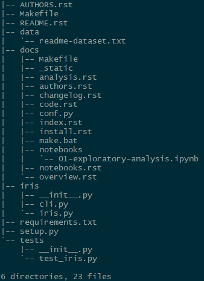
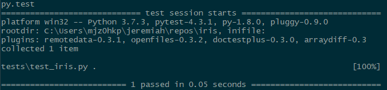
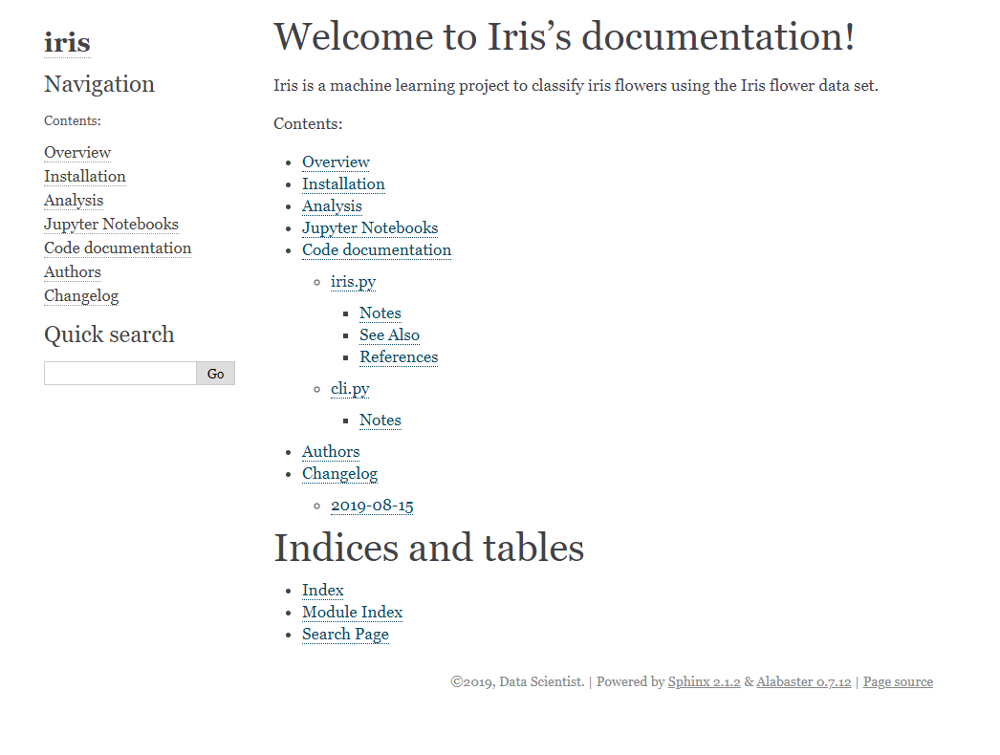
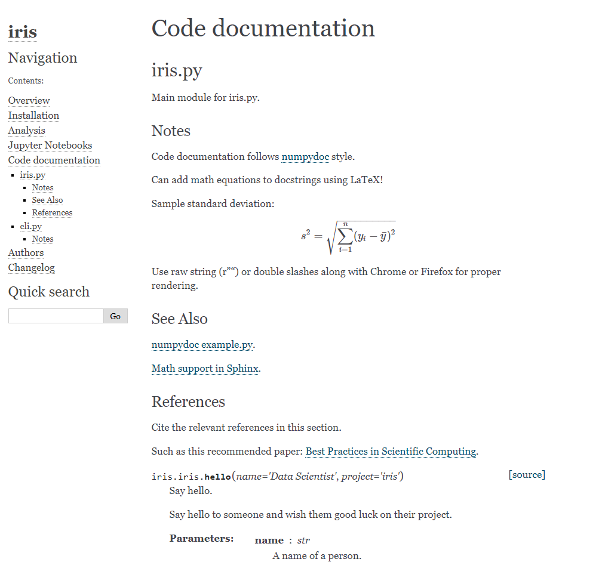
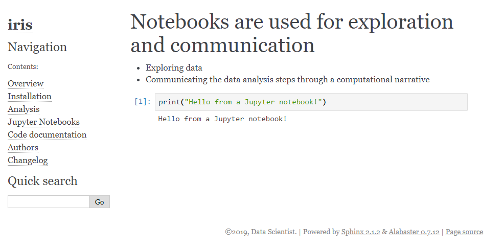
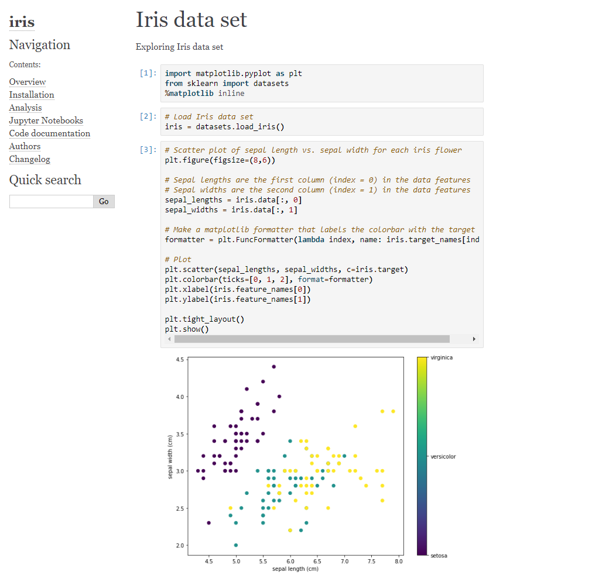

cookiecutter-pyproj
=======================

*A simple Python project template for data science projects.*

Features
--------

* Simple, clear, and structured Python_ project template
* Initial Jupyter_ set up for data exploration
* Code testing set up with pytest_
* Initial project and code documentation website set up with Sphinx_
* Jupyter notebooks are embedded in the Sphinx_ project documentation using nbsphinx_
* Command line interface set up with Click_ for easy command line running of analysis
* Preformatted README file
* Helpful project cleanup with an initial Makefile_
* Installation ready `setup.py` file
* Template "readme" style for metadata from `Research Data Management Service Group at Cornell University`_

Usage
-----

To create the template Python_ project, run the Cookiecutter_ program in a directory of your choice with the
URL of this cookiecutter-pyproj_ template project::

   $ cookiecutter https://github.com/jlant/cookiecutter-pyproj.git

After running the command above, you will be prompted to answer a few questions about your project.  Next, your
project template will be created in your current working directory.

The followings is a sample project layout along with a description of all the contents::

   |-- AUTHORS.rst                                 List of authors working on the project
   |-- Makefile                                    Top-level Makefile, list commands with `make help`
   |-- README.rst                                  Project README
   |-- data                                        Directory for raw and processed data
   |   `-- readme-dataset.txt                      Template "readme.txt" style metadata, replace "dataset" with name of your dataset
   |-- docs                                        Directory for project and code documentation using Sphinx
   |   |-- Makefile                                Sphinx Makefile
   |   |-- _static                                 Directory for project website styles and project images/figures
   |   |-- analysis.rst                            File to describe detailed project analysis
   |   |-- authors.rst                             Copy of AUTHORS.rst from top-level directory
   |   |-- changelog.rst                           List of dated notes about project changes
   |   |-- code.rst                                File to automatically document your code docstrings
   |   |-- conf.py                                 Sphinx configuration file
   |   |-- index.rst                               Main project documentation page, links all documentation *.rst files
   |   |-- install.rst                             File to describe how to install project requirements
   |   |-- make.bat                                Sphinx make.bat file
   |   |-- notebooks                               Directory containing Jupyter notebooks used for data exploration and communicating a computational narrative
   |   |   `-- 01-exploratory-analysis.ipynb       Sample first Jupyter notebook on project exploratory analysis, can use 01-*, 02-*, ... for logical ordering
   |   |-- notebooks.rst                           File to list Jupyter notebooks contained in `notebooks` directory for proper linking in project documentation
   |   `-- overview.rst                            File to provide a high-level overview of the project
   |-- <project_name>                              Directory for project source code
   |   |-- __init__.py                             Python file to make source code directory a Python package
   |   |-- cli.py                                  Command line interface file using Click
   |   `-- <project_name>.py                       Main project module
   |-- requirements.txt                            List of project requirements to reproduce project environment
   |-- setup.py                                    Python installation file, used if project source code is to be installed on another machine
   `-- tests                                       Directory for all tests of source code using pytest (as default)
       |-- __init__.py                             Python file to make tests directory a Python package
       `-- test_<project_name>.py                  Sample test file for source code

Example
-------
The following is an example of a typical Data Scientist creating a cookiecutter-pyproj_ template for a
machine learning project using the `Iris flower data set`_ in just 2 steps.

1. Run the cookiecutter program with the cookiecutter-pyproj_ template::

    $ cookiecutter https://github.com/jlant/cookiecutter-pyproj.git

2. Answer the following prompts::

    author [Your name]: Data Scientist
    email [Your email]: datascientist@somewhere.com
    project_name [Your project name]: Iris
    project_slug [iris]: <Enter>
    project_description [A short description of the project]: Iris is a machine learning project to classify iris flowers using the Iris flower data set.
    date [2019-08-15]: <Enter>

Now, the Data Scientist can view the contents of the template project::

    $ tree iris

and, run tests using top-level Makefile::

   $ cd iris
   $ make tests

or, run tests using pytest_ directly::

   $ cd iris
   $ pytest tests

and, make the projects website and code documentation using top-level Makefile::

   $ make docs

or, make the projects website and code documentation using Sphinx directory::

   $ cd docs
   $ make html

The project documentation HTML pages are contained in the `_build\html` directory. 
Open `index.html` in your favorite browser to view website.

Screenshot of the sample code documentation:

Screenshot of the sample Jupyter notebook embedded into the project documentation website:

Screenshot of an example Jupyter notebook plotting the iris data set embedded into the project documentation website: 

| With the boilerplate project framework and structure already finished,
| the Data Scientist can now start doing data science, the fun part!

Requirements
------------
To get your Python_ data science project up and running locally, please install the following:

* Python_
* Cookiecutter_
* Jupyter_
* pytest_
* Sphinx_
* nbsphinx_
* Click_

Acknowledgements
----------------
Thank you Cookiecutter_!

.. _Cookiecutter: https://github.com/cookiecutter/cookiecutter
.. _Click: https://click.palletsprojects.com/en/7.x/
.. _Python: https://www.python.org/
.. _Jupyter: https://jupyter.org/
.. _pytest: https://docs.pytest.org/en/latest/
.. _Sphinx: http://www.sphinx-doc.org/en/master/
.. _nbsphinx: https://nbsphinx.readthedocs.io/en/0.4.2/index.html
.. _Research Data Management Service Group at Cornell University: https://data.research.cornell.edu/content/readme
.. _Makefile: https://en.wikipedia.org/wiki/Makefile
.. _Iris flower data set: https://en.wikipedia.org/wiki/Iris_flower_data_set
.. _cookiecutter-pyproj: https://github.com/jlant/cookiecutter-pyproj.git
